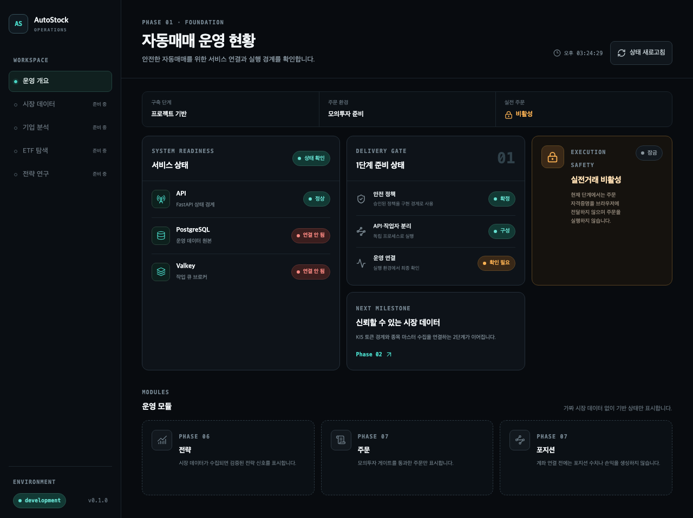

# Auto Stock Trading

국내 주식·ETF 데이터 수집, 기업 분석, 퀀트 전략 연구와 안전한 자동매매 실행을 단계적으로 구축하는 웹 프로젝트다. 현재 2단계에서는 KIS 국내주식·ETF 종목정보, 현재가와 비수정 일봉의 수집·저장·읽기 수직 슬라이스를 제공한다.



> 현재 실행 화면은 기능성 프로토타입이다. 사용자는 [클로드 화면 디자인 사양](design/claude-design/screen-design-spec.md)을 최종 방향으로 승인했지만 React 화면에는 아직 적용되지 않았다. 다음 작업과 구현 상태는 [현재 프로젝트 상태와 다음 세션 인계](plan/current-status.md)를 기준으로 한다.

## 현재 구현 범위

- FastAPI 생존·준비 상태 API
- PostgreSQL 18 마이그레이션과 Valkey 작업 큐
- Valkey 공유 KIS 토큰·호출 게이트와 대표 주식·ETF 시장 데이터 수집 Taskiq worker
- 원본 응답과 정규화 데이터를 분리한 PostgreSQL 저장소
- 종목정보·최신 현재가·비수정 일봉 읽기 API
- Caddy가 제공하는 React 운영 대시보드와 API 프록시
- 모바일·태블릿·데스크톱 Playwright 검증
- 코드와 문서 변경을 함께 검사하는 문서 동기화 게이트

주문, 계좌, 분봉·시장 달력·기업행사, 전략과 AI 모델은 아직 구현하지 않았다. 실제 KIS 모의환경 호출은 서버 자격증명이 준비되면 검증하며 실전거래는 승인된 [전환 게이트](spec/paper-to-live-gate.md)를 통과하기 전까지 비활성 상태를 유지한다.

## 실행

Docker와 Colima가 준비된 macOS 환경에서는 저장소 루트에서 실행한다.

```bash
docker compose -f infra/compose.yaml up --build -d --wait --wait-timeout 300
```

- 웹: `http://localhost:8080`
- API 준비 상태: `http://localhost:8000/api/health/ready`

도구 설치, 개별 프로세스 실행과 품질 검사 명령은 [로컬 개발과 실행](operations/local-development.md)을 따른다. 전체 구조와 기술 선택은 [프로젝트 실행 구조](architecture/project-structure.md)와 [상세 기술 스택](architecture/tech-stack.md)에 기록한다.

## 구조

```text
Caddy + React
      │ /api
   FastAPI ── PostgreSQL
      │
Taskiq worker ── Valkey
```

## 문서 관리

이 디렉터리는 `auto-stock-trading` 프로젝트에서 생성하는 모든 문서의 단일 저장 위치다.

### 문서 관리 원칙

- 프로젝트 문서는 반드시 `docs/` 또는 그 하위 디렉터리에 저장한다.
- 프로젝트 루트나 소스 디렉터리에 별도의 기획·설계 문서를 만들지 않는다.
- 문서는 내용의 성격에 맞는 카테고리 디렉터리에 저장한다.
- 파일 이름은 소문자 kebab-case를 사용한다.
- 새 문서를 추가하거나 이동하면 이 색인의 링크도 함께 갱신한다.
- 계획이나 명세가 변경되면 새 문서를 중복 생성하기보다 기존 문서의 변경 이력을 남기고 갱신한다.
- API 키, 계좌번호, 토큰, 개인정보는 문서에 기록하지 않는다.

### 카테고리

| 디렉터리 | 용도 |
|---|---|
| `plan/` | 구현 순서, 마일스톤, 작업 계획 |
| `spec/` | 제품 요구사항, 기능 범위, 완료 조건 |
| `architecture/` | 시스템·배포·보안 아키텍처 |
| `design/` | UI 디자인 토큰, 컴포넌트 및 상호작용 규칙 |
| `api/` | 내부 API 및 외부 증권사 API 연동 명세 |
| `data/` | 데이터 모델, 지표 정의, 데이터 품질 규칙 |
| `ai/` | 학습 데이터, 모델, 평가 및 운영 명세 |
| `operations/` | 배포, 모니터링, 장애 대응, 백업 |
| `qa/` | 테스트 전략, 검증 시나리오, QA 증거 |
| `decisions/` | 주요 기술·제품 결정 기록(ADR) |
| `governance/` | 문서 정책, 변경 매핑, 승인 절차 |
| `generated/` | 코드와 문서 메타데이터에서 자동 생성된 문서 |

현재는 실제 문서가 있는 카테고리만 생성한다. 새 카테고리는 해당 문서를 처음 추가할 때 만든다.

### 문서 색인

#### Plan

- [현재 프로젝트 상태와 다음 세션 인계](plan/current-status.md)
- [구현 로드맵](plan/implementation-roadmap.md)

#### Spec

- [제품 범위 및 요구사항](spec/product-scope.md)
- [거래 안전 정책](spec/trading-safety-policy.md)
- [시장 데이터 및 시점 정책](spec/market-data-policy.md)
- [모의투자·실전투자 전환 게이트](spec/paper-to-live-gate.md)

#### Architecture

- [상세 기술 스택](architecture/tech-stack.md)
- [프로젝트 실행 구조](architecture/project-structure.md)

#### Design

- [자동매매 운영 UI 디자인 시스템](design/design-system.md)
- [자동매매 웹 디자인 방향 제안](design/design-direction-proposals.md)
- [디자인 시안 생성 프롬프트](design/proposal-generation-prompts.md)
- [화면 디자인 사양](design/claude-design/screen-design-spec.md)
- [화면 구현 요청 안내](design/claude-design/README.md)

#### API

- [내부 상태 확인 API](api/health-api.md)
- [시장 데이터 읽기 API](api/market-data-api.md)

#### Operations

- [로컬 개발과 실행](operations/local-development.md)
- [KIS 모의환경 검증 런북](operations/kis-paper-verification.md)

#### QA

- [1단계 검증 기록](qa/phase-1-verification.md)
- [1단계 시각 QA 감사 기록](qa/phase-1-visual-review.md)
- [2단계 시장 데이터 수직 슬라이스 검증](qa/phase-2-market-data-verification.md)
- [디자인 방향 시안 시각 QA](qa/evidence/design-direction-proposals/visual-qa.md)

#### Decisions

- [ADR-0001: 모듈형 모놀리스 채택](decisions/0001-modular-monolith.md)
- [ADR-0002: Python·React 기술 기준선 채택](decisions/0002-technology-baseline.md)
- [ADR-0003: PostgreSQL 중심 데이터 아키텍처 채택](decisions/0003-data-architecture.md)
- [ADR-0004: AI 신호와 주문 실행 분리](decisions/0004-ai-execution-separation.md)
- [ADR-0005: Valkey 기반 KIS 토큰·호출 조정](decisions/0005-kis-token-and-rate-coordination.md)

#### Governance

- [문서 동기화 정책](governance/documentation-policy.md)
- [코드-문서 변경 매핑](governance/change-map.yaml)

#### Generated

- [문서 인벤토리](generated/document-inventory.md)
