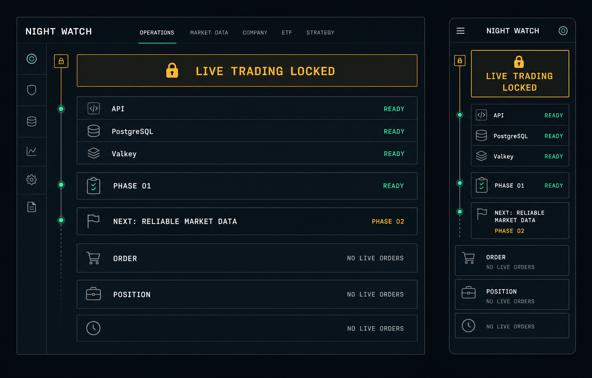
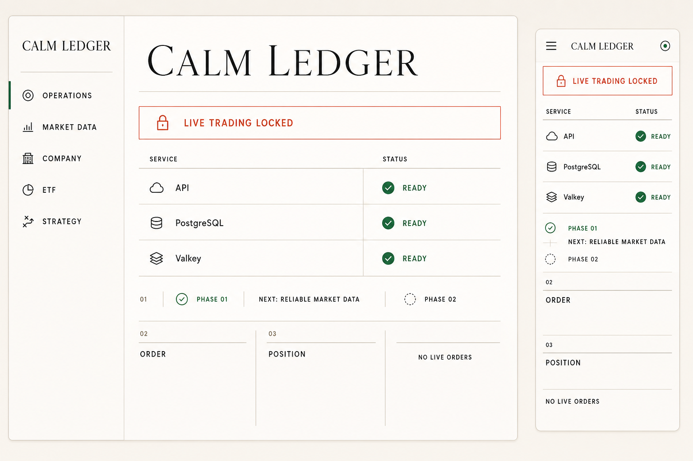
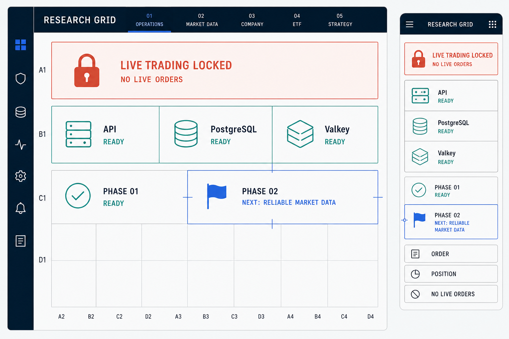

# 자동매매 웹 디자인 방향 제안

- 상태: 승인
- 작성일: 2026-08-11
- 승인일: 2026-08-12
- 적용 대상: 운영 대시보드와 이후 시장 데이터·기업 분석·ETF 탐색·전략 연구 화면
- 현재 구현 영향: 승인된 구현 기준으로 확정. 기존 프론트엔드는 아직 기능성 프로토타입이며 별도 구현 작업이 필요하다.
- 생성 프롬프트: [디자인 시안 생성 프롬프트](proposal-generation-prompts.md)
- 시각 검증: [디자인 방향 시안 시각 QA](../qa/evidence/design-direction-proposals/visual-qa.md)

## 이번 승인에서 결정할 내용

이번에는 실제 컴포넌트의 세부 간격이 아니라 제품 전체가 따를 시각 언어를 결정한다.

- 밝기와 색상 체계
- 한 화면의 정보 밀도
- 내비게이션과 주요 정보 배치
- 거래 안전 상태를 강조하는 방식
- 데스크톱과 모바일에서의 재배치 원칙
- 이후 표·차트·필터 화면이 확장될 기본 골격

시안 속 영문은 이미지 생성 과정의 오탈자를 줄이기 위한 짧은 레이아웃 표기다. 방향 승인 후 실제 구현에는 기존 한국어 제품 문구와 접근성 규칙을 적용한다.

## 모든 시안에 고정한 제품 요구사항

- 실전거래 비활성 상태를 첫 화면에서 즉시 확인할 수 있어야 한다.
- API, PostgreSQL, Valkey의 실제 준비 상태만 표시한다.
- 1단계 기반 구축 완료와 다음 목표인 신뢰 가능한 시장 데이터 수집을 구분한다.
- 주문·포지션·전략 데이터가 없는 현재 단계에는 가짜 가격, 수익률, 보유 수량 또는 차트를 표시하지 않는다.
- 모바일은 데스크톱 축소판이 아니라 안전 상태부터 읽히는 1열 구조로 재배치한다.
- 이후 ETF 순위표, 기업 분석, OHLCV·보조지표와 전략 연구 화면으로 확장할 수 있어야 한다.

## 비교 요약

| 구분 | 1안 Night Watch | 2안 Calm Ledger | 3안 Research Grid |
|---|---|---|---|
| 핵심 인상 | 자동매매 관제실 | 차분한 자산관리 원장 | 기관용 리서치 워크스테이션 |
| 기본 밝기 | 다크 | 라이트 | 라이트 작업면 + 네이비 셸 |
| 정보 밀도 | 높음 | 낮음~중간 | 중간~높음 |
| 강점 | 안전·운영 상태를 가장 빠르게 파악 | 장시간 읽기 편하고 친근함 | ETF·기업·전략 도구로 확장하기 가장 유리 |
| 주의점 | 초보 사용자에게 전문 도구처럼 느껴질 수 있음 | 실시간 운영 정보가 많아지면 공간 효율이 낮음 | 격자 규칙을 과하게 쓰면 화면이 경직될 수 있음 |
| 적합한 사용자 | 운영자·개발자 중심 | 개인 투자자 중심 | 개인 퀀트 연구자와 운영자를 함께 고려 |
| 모바일 방향 | 경고와 상태를 세로 추적 | 원장 항목을 순서대로 읽기 | 핵심 셀을 우선순위대로 재배치 |

## 1안: Night Watch

짙은 흑연색 화면, 얇은 상태 추적선과 제한된 청록·주황색으로 자동매매 시스템의 운영 상태를 표현한다. 정보는 행 단위로 촘촘하게 배치하고 실전거래 잠금 상태를 화면의 최우선 요소로 둔다.

- 장점: 장애·연결·실행 상태처럼 즉시 판단해야 할 정보에 강하다.
- 확장 방식: 주문 감시, 작업 큐, 데이터 수집 지연과 전략 실행 상태를 같은 행 구조로 추가한다.
- 적합성: 자동매매의 `운영 콘솔` 성격을 가장 강하게 만들고 싶을 때 적합하다.

## 2안: Calm Ledger

따뜻한 종이색 배경, 원장처럼 이어지는 구분선과 넉넉한 여백으로 금융 서비스의 신뢰와 읽기 편한 흐름을 강조한다. 경고는 붉은 한 줄 테두리로 절제해서 표시한다.

- 장점: 재무·기업 분석 설명과 긴 리서치 콘텐츠를 편하게 읽을 수 있다.
- 확장 방식: 기업 재무표, ETF 비교표와 분석 보고서를 문서형 섹션으로 구성한다.
- 적합성: 복잡한 운영 도구보다 `차분한 개인 투자 분석 서비스`의 인상을 우선할 때 적합하다.

## 3안: Research Grid

네이비 셸과 밝은 작업면, 엄격한 격자와 좌표 라벨로 분석 도구의 구조를 드러낸다. 상태, 다음 목표와 빈 모듈을 서로 독립적인 셀로 배치해 화면별 조합을 바꾸기 쉽다.

- 장점: ETF 순위표, 기업 지표, 차트·보조지표, 백테스트 결과처럼 성격이 다른 정보를 한 시스템 안에서 확장하기 좋다.
- 확장 방식: 넓은 화면은 비교 패널, 좁은 화면은 우선순위가 높은 셀부터 1열로 재배치한다.
- 적합성: `리서치 + 퀀트 전략 + 안전한 자동매매 운영`을 하나의 제품으로 묶을 때 가장 균형이 좋다.

## 권장 방향

기본 방향은 **3안 Research Grid**를 권장한다. 이 프로젝트는 단순 주문 화면보다 ETF 탐색, 기업 분석, OHLCV·보조지표 연구, 백테스트와 운영 상태를 함께 다뤄야 하므로 격자 기반 작업면이 장기 확장에 가장 유리하다.

단, 승인 시 **1안의 안전 경고 대비와 서비스 상태 추적 방식**을 3안의 상태 컴포넌트에 결합하는 것을 권장한다. 색상과 전체 레이아웃은 3안을 유지하고, 실전거래 잠금과 장애 상태만 1안처럼 더 빠르게 식별하도록 만드는 조합이다.

## 승인 결과와 후속 작업

사용자는 2026-08-12에 클로드가 상세화한 **3안 Research Grid + 1안 Night Watch 안전 상태 표현**을 승인했다.

- 공식 화면 계약: [클로드 화면 디자인 사양](claude-design/screen-design-spec.md)
- 전체 화면 참조: [클로드 HTML 시안](claude-design/screen-mockups.html)
- 적용 대상: 운영 개요, 시장 데이터, 기업 분석, ETF, 전략 연구, 모의매매, 설정·감사, 실전 전환과 상태 화면
- 제외: 시안에 표시된 예시 가격, 수익률, 계좌, 주문과 포지션 값

승인 후에는 다음 순서로 진행한다.

1. 선택한 방향의 색상, 타이포그래피, 간격, 격자와 반응형 규칙을 [디자인 시스템](design-system.md)에 반영하고 상태를 `승인`으로 변경한다.
2. 기존 운영 대시보드를 승인된 디자인으로 구현한다.
3. 375px, 768px, 1280px 이상 화면에서 실제 브라우저 시각 QA와 접근성 검사를 수행한다.
4. 승인된 디자인 시스템을 이후 시장 데이터·기업 분석·ETF·전략 화면의 기준으로 사용한다.

## 결정 기록

- 선택 방향: 3안 Research Grid를 클로드 화면 사양으로 상세화한 방향
- 결합할 요소: 1안 Night Watch의 안전 경고 대비와 상태 우선순위
- 승인자: 사용자
- 승인일: 2026-08-12
- 구현 상태: 디자인 계약 승인, React 구현 미착수
